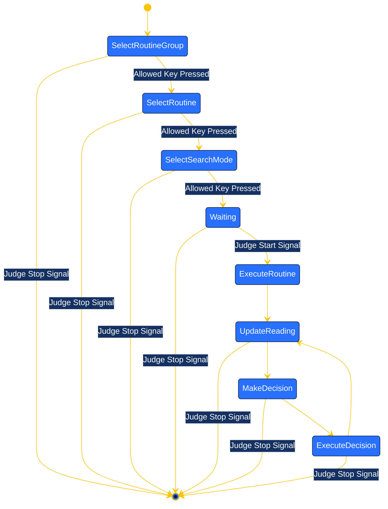

# Diagrams
## State Machine Diagram

```mermaid
%%{
  init: {
    'theme': 'base',
    'themeVariables': {
      'primaryColor': '#2970FF',
      'primaryTextColor': '#FFFFFF',
      'primaryBorderColor': '#0C1E3E',
      'lineColor': '#FFC300',
      'secondaryColor': '#153161',
      'tertiaryColor': '#F7F6F3'
    }
  }
}%%

stateDiagram
  [*] --> SelectRoutineGroup
  SelectRoutineGroup --> [*]: Judge Stop Signal
  SelectRoutineGroup --> SelectRoutine: Allowed Key Pressed
  SelectRoutine --> [*]: Judge Stop Signal
  SelectRoutine --> SelectSearchMode: Allowed Key Pressed
  SelectSearchMode --> [*]: Judge Stop Signal
  SelectSearchMode --> Waiting: Allowed Key Pressed
  Waiting --> [*]: Judge Stop Signal
  Waiting --> ExecuteRoutine: Judge Start Signal
  ExecuteRoutine --> UpdateReading
  UpdateReading --> [*]: Judge Stop Signal
  UpdateReading --> MakeDecision
  MakeDecision --> [*]: Judge Stop Signal
  MakeDecision --> ExecuteDecision
  ExecuteDecision --> [*]: Judge Stop Signal
  ExecuteDecision --> UpdateReading
```

## Class Diagram

```mermaid
%%{
  init: {
    'theme': 'base',
    'themeVariables': {
      'primaryColor': '#2970FF',
      'primaryTextColor': '#FFFFFF',
      'primaryBorderColor': '#FFC300',
      'lineColor': '#FFC300',
      'secondaryColor': '#FFC300',
      'tertiaryColor': '#FFC300'
    }
  }
}%%

classDiagram
  class SensorPositions{
    <<enumeration>>
    RIGHT
    RIGHT_FRONT
    FRONT
    LEFT_FRONT
    LEFT
  }

  class SensorDecision{
    <<enumeration>>
    FRONT_ATTACK
    OPEN_RIGHT_CURVE
    CLOSE_RIGHT_CURVE
    ADJUST_RIGHT
    QUICK_ADJUST_RIGHT
    BRUTE_ADJUST_RIGHT
    OPEN_LEFT_CURVE
    CLOSE_LEFT_CURVE
    ADJUST_LEFT
    QUICK_ADJUST_LEFT
    BRUTE_ADJUST_LEFT
  }

  class MotorId{
    <<enumeration>>
    TB66
    L298N
  }

  class MoveMode{
    <<enumeration>>
    NORMAL
    SEARCH
    ACCELERATE
    SEARCH_ACCELERATE
    ONE_WHEEL
    ONE_WHEEL_SEARCH
    CURVE
    CURVE_SEARCH
    CURVE_ACCELERATE
    CURVE_SEARCH_ACCELERATE
  }

  class InvertedWheel{
    <<enumeration>>
    RIGHT
    LEFT
    BOTH
  }

  class MotorDeffinitions{
    <<struct>>
    +int PWM_RESOLUTION = 255
    +int MAX_VELOCITY = 100
    +float RADIUS = 55
  }

  class ReceiverData{
    <<enumeration>>
    A
    B
    C
    D
    E
    F
    G
    H
    I
    UP
    RIGHT
    DOWN
    LEFT
    PARITY
    ON
    OFF
  }

  class LedMode{
    <<enumeration>>
    ON
    OFF
    BLINK
    NUMBER
  }

  class BlinkMode{
    <<enuration>>
    SLOW_BLINK
    FAST_BLINK
    SLOW_FAST_BLINK
    SLOW_SLOW_BLINK
    FAST_SLOW_BLINK
    FAST_FAST_BLINK
  }

  class LedDeffinitions{
    <<struct>>
    +int FAST_DELAY = 100
    +int SLOW_DELAY = 300
  }

  class Sensor{
    -String pin
    -bool see
    -bool saw
    -int readingTime
    -int blindTime

    +bool Set(String)
    +String GetPin()
    +bool IsSeeing()
    +bool HaveSaw()
    +int SeeTime()
    +int BlindTime()

    +void Update()
  }

  class SensorControll{
    +bool Set(String, String, String, String, String)
    +void Update()
    +void Decision()
  }

  class Motor{
    -MotorId id
    -bool inverted
    -int signalPin[2]
    -int pwmPin
    -float velocity
    -float pwm

    +Set(int, int, int, bool, MotorId)
    +void Move(float, float)
    +void SetPwm(float)
    +float GetVelocity()
  }

  class MotorControll{
    -float SetCurve(float, float)

    +bool Set(int, int, int, int, int, int, MotorId, InvertedWheel)
    +bool Set(int, int, int, int, int, int, MotorId)

    +bool Front(float, float, MoveMode)
    +bool Right(float, float, MoveMode)
    +bool Right(float, float, float, MoveMode)
    +bool Left(float, float, MoveMode)
    +bool Left(float, float, float, MoveMode)
    +bool Back(float, float, MoveMode)
  }

  class ReceiverControll{
    -int pin
    -ReceiverData data

    +bool Set(int)
    +ReceiveData GetData()
  }

  class Led{
    -int pin
    -bool state

    +bool Set(int)
    #void On()
    #void Off()
    #void SingleBlink()
    #void DoubleBlink()
  }

  class LedControll{
    +void Controll(LedMode)
    +void Controll(BlinkMode, BlinkMode)
    +void Controll(LedMode, int)
    +void Controll(int)
  }

  class Robot{
    
  }

  Sensor "5" --* "1" SensorControll
  Motor "2" --* "1" MotorControll
  MotorDeffinitions "1" --* "1" MotorControll
  Led "*" --* "1" LedControll
  LedDeffinitions "1" --* "1" LedControll
  SensorControll "1" --* "1" Robot
  MotorControll "1" --* "1" Robot
  LedControll "1" --* "1" Robot
  ReceiverControll "1" --* "1" Robot
```